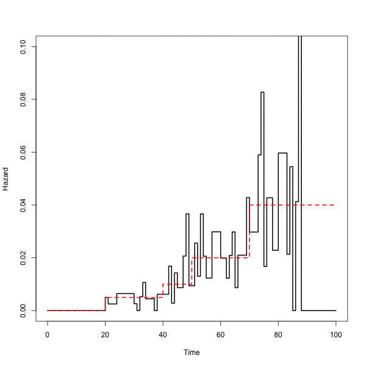

# pchsurv

This package provides estimations of the hazard function for time to event data in the piecewise contant hazard model.

- The `mlepchsurv` function estimates the hazard function using fixed cuts. 
- The `arpchsurv` function implements the ridge and adaptive ridge piecewise constant hazard estimator. The latter allows to automatically find the number of cuts and their locations and to derive the resulting hazard estimator.
- The `bootpchsurv` function uses a bootstrap method to derive an alternative estimator. A smmoth estimator of the survival function can be derived from this function.

