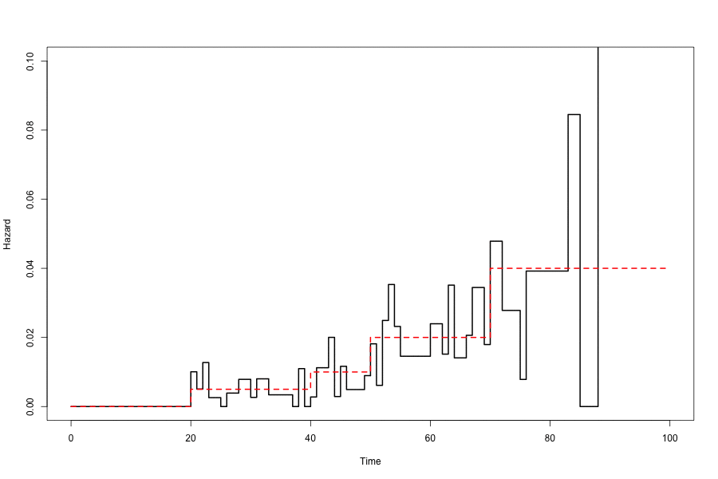
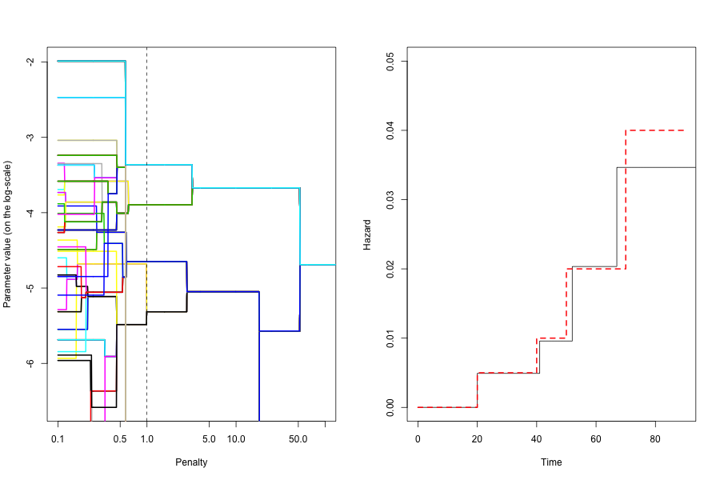

# pchsurv

This package provides estimations of the hazard function for time to event data in the piecewise contant hazard model.

- The `rsurv` function simulate data from a piecewise-constant hazard model.
- The `mlepchsurv` function returns the maximum likelihood hazard estimates using fixed cuts. 
- The `arpchsurv` function implements the ridge and adaptive ridge piecewise constant hazard estimators. The latter allows to automatically find the number of cuts and their locations and to derive the resulting piecewise constant hazard estimator.
- The `bootpchsurv` function uses a bootstrap method to derive an alternative estimator. A smooth estimator of the survival function can be derived from this function.

In the first figure below the adaptive ridge estimator has been implemented for different penalties. In the second figure the regularization path is shown. The Bayesian Information Criteria is used to select the final model. The selected model is shown by the dotted vertical line on the left figure and the final estimated hazard is shown on the right figure.

